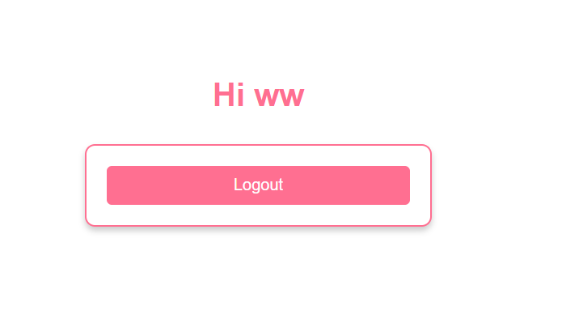

# Node.js Passport Login

This is a simple user authentication system built with **Node.js** and **Passport.js**. The application provides a **login** and **registration system** with **sessions**, allowing users to log in with their credentials securely. This project demonstrates how to implement **authentication** in a Node.js application using **Passport.js**.

## Technologies Used

- **Node.js**: JavaScript runtime to run the server-side code.
- **Express.js**: Web framework to build the application.
- **Passport.js**: Authentication middleware for Node.js.
- **bcrypt.js**: Library to hash and compare passwords securely.
- **express-session**: Used to manage user sessions.
- **express-flash**: Displays flash messages for user notifications.
- **EJS**: Templating engine used to render views.
- **Method Override**: Allows support for HTTP methods like DELETE in forms.

## Acknowledgments
This project was learned from the [Node.js Passport Login](https://github.com/WebDevSimplified/Nodejs-Passport-Login) repository by Web Dev Simplified.
